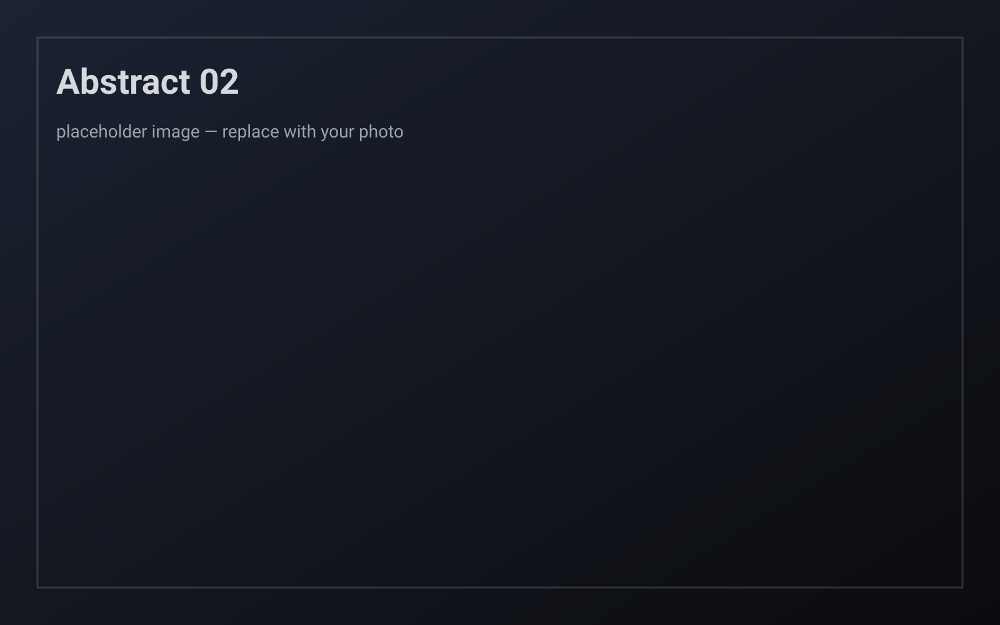

  

    
Portfolio

    <h1>Photography</h1>
    
Portraits · Urban &amp; Atmospheres · Abstract &amp; Motion

  

  

    

      <h2>Portraits</h2>
      may include nudity
    

    

      
This section may include nudity or intimate themes. The intention is vulnerability and presence, not provocation.

      <button class="gate-btn" data-target="portraits-grid">I understand, show content</button>
    

    

      

        <!-- Replace src with Cloudinary URLs when ready -->
        <!-- Format: https://res.cloudinary.com/YOUR_CLOUD/image/upload/w_800,q_auto,f_auto/PHOTO_ID.jpg -->
        <article class="photo-card">
          
          

            
Portrait 01

            
Subject · Place · Year

          

        </article>
        <article class="photo-card">
          
          

            
Portrait 02

            
Subject · Place · Year

          

        </article>
        <article class="photo-card">
          
          

            
Portrait 03

            
Subject · Place · Year

          

        </article>
      

    

  

  

    

      <h2>Urban &amp; Atmospheres</h2>
      cities, edges, liminal moments
    

    

      <article class="photo-card">
        
        

          
Urban 01

          
Place · Year

        

      </article>
      <article class="photo-card">
        
        

          
Urban 02

          
Place · Year

        

      </article>
      <article class="photo-card">
        
        

          
Urban 03

          
Place · Year

        

      </article>
    

  

  

    

      <h2>Abstract &amp; Motion</h2>
      instinct, subconscious, blur as language
    

    

      <article class="photo-card">
        
        

          
Abstract 01

          
Year

        

      </article>
      <article class="photo-card">
        
        

          
Abstract 02

          
Year

        

      </article>
      <article class="photo-card">
        
        

          
Abstract 03

          
Year

        

      </article>
    

  

  

    <h2>Exhibitions</h2>
    <ul>
      <!-- Add your two exhibitions here -->
      <!-- Format: <li>Exhibition Name · Venue, City · Year</li> -->
      <li>Exhibition name · Venue, City · Year</li>
      <li>Exhibition name · Venue, City · Year</li>
    </ul>
  

