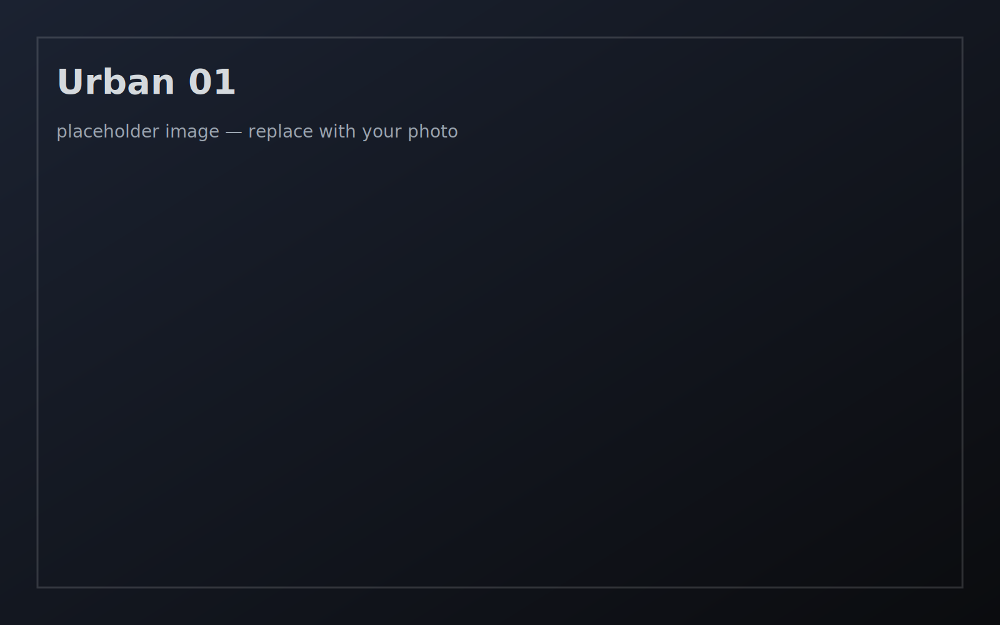
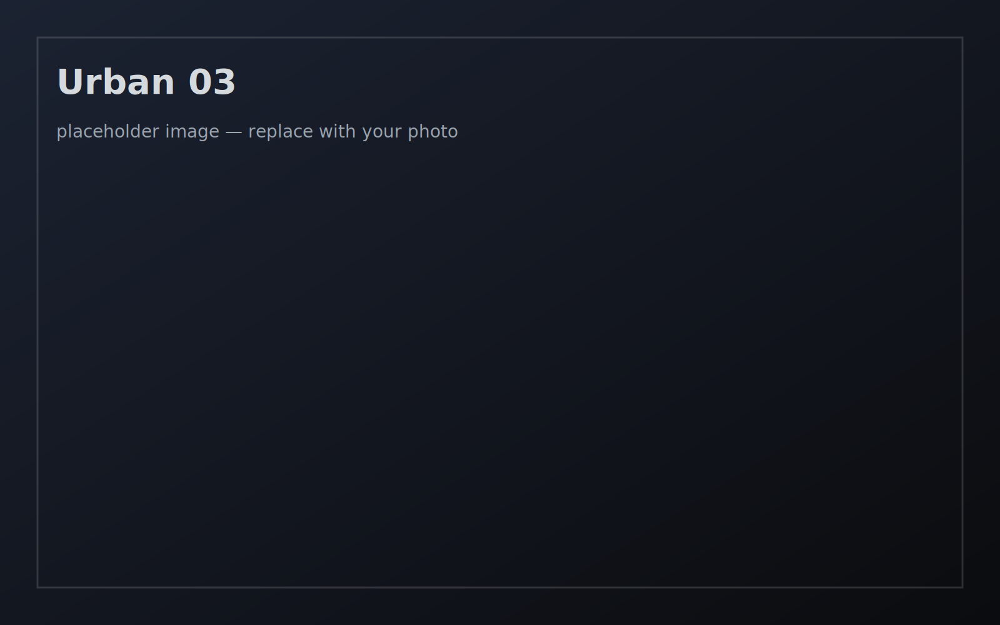
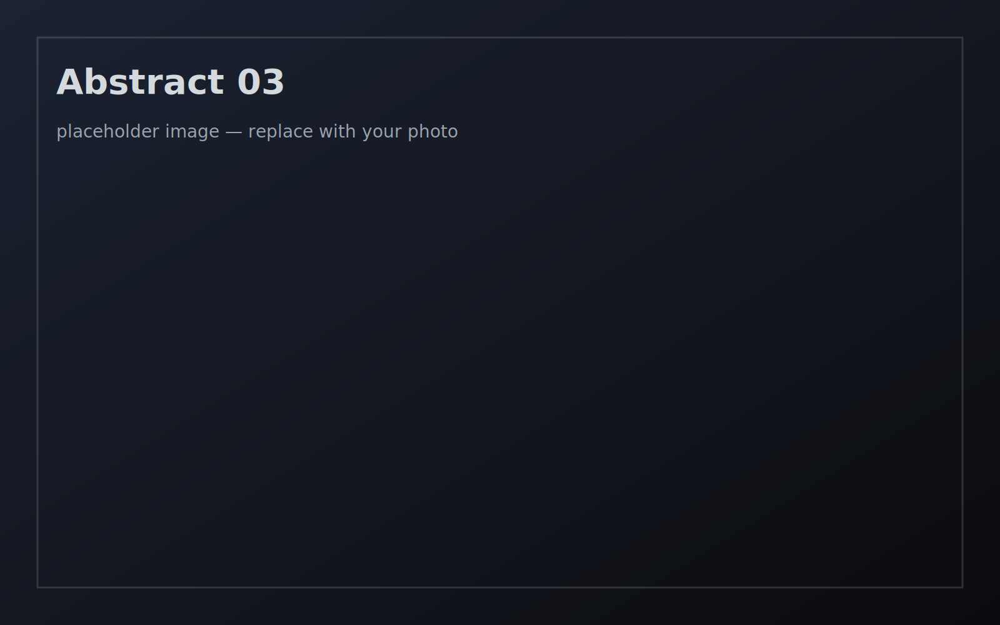

<section class="p-section">
  

    <h2 class="p-section__title">Portraits</h2>
    
NSFW-sensitive

  

  

    <strong>Content note.</strong> This section may include nudity or intimate themes.
    The intention is vulnerability and presence, not provocation.
    If you prefer, explore <em>Urban & Atmospheres</em> or <em>Abstract & Motion</em> first.
  

  

    <article class="p-card">
      
      

        
Portrait 01 — Placeholder

        
Caption placeholder: subject, place, year, intention.

      

    </article>
    <article class="p-card">
      
      

        
Portrait 02 — Placeholder

        
Caption placeholder: light, texture, emotional note.

      

    </article>
    <article class="p-card">
      
      

        
Portrait 03 — Placeholder

        
Caption placeholder: framing choices, narrative thread.

      

    </article>
  

</section>

<section class="p-section">
  

    <h2 class="p-section__title">Urban & Atmospheres</h2>
    
cities, edges, liminal moments

  

  

    <article class="p-card">
      
      

        
Urban 01 — Placeholder

        
Caption placeholder: street, hour, weather, mood.

      

    </article>
    <article class="p-card">
      
      

        
Urban 02 — Placeholder

        
Caption placeholder: movement, blur, distance compression.

      

    </article>
    <article class="p-card">
      
      

        
Urban 03 — Placeholder

        
Caption placeholder: lines, reflections, quiet tension.

      

    </article>
  

</section>

<section class="p-section">
  

    <h2 class="p-section__title">Abstract & Motion</h2>
    
instinct, subconscious, blur as language

  

  

    <article class="p-card">
      
      

        
Abstract 01 — Placeholder

        
Caption placeholder: color, gesture, distortion.

      

    </article>
    <article class="p-card">
      
      

        
Abstract 02 — Placeholder

        
Caption placeholder: texture, noise, emergence.

      

    </article>
    <article class="p-card">
      
      

        
Abstract 03 — Placeholder

        
Caption placeholder: series link, sequencing note.

      

    </article>
  

</section>
